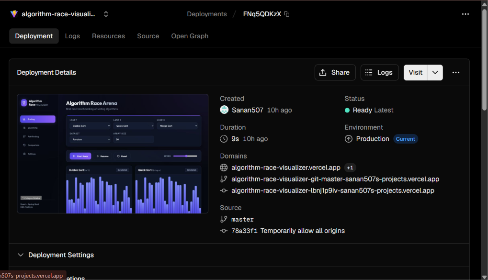

# AlgoRace

**Visualize. Compare. Benchmark.**

A full-stack web application for real-time visualization, side-by-side comparison, and benchmarking of classic computer science algorithms.

## Live Demo

- **Frontend**: https://algorithm-race-visualizer.vercel.app
- **Backend**: Spring Boot API (Render / Local)

---

## Preview




---

## Overview

AlgoRace provides an interactive playground for exploring algorithms:

* **Multi-Lane Arenas**: Compare multiple algorithms side-by-side simultaneously.
* **Live Step Debugger & Frame Scrubbing**: Step forward, step backward, or scrub through execution timelines using an interactive seek bar.
* **Interactive Pathfinding Editor**: Click and drag directly on the pathfinding canvas to draw or remove custom walls in real time.
* **Code & Pseudocode Inspector**: Expand inline pseudocode drawers to follow execution logic step-by-step.
* **Accurate Color Visuals**: Distinct glowing visual indicators for comparisons, swaps, pivots, heap boundaries, merge regions, and sorted boundaries.
* **Real-time Performance Benchmarking**: Live comparison charts tracking execution time ($ms$), operations ($comparisons / steps$), and swaps.
* **Web Audio Sound Engine**: Clean, vibraphone-style acoustic feedback for race events.

---

## Features & Arenas

### 1. Sorting Arena

Compare classic sorting algorithms on uniform datasets:

* **Supported Algorithms**: Bubble Sort, Selection Sort, Insertion Sort, Merge Sort, Quick Sort, Heap Sort, Comb Sort.
* **Dataset Types**: Random, Nearly Sorted, Reversed, Few Unique, Custom Array.
* **Visual Cues**:
  * **Royal Indigo / Violet**: Unsorted array elements.
  * **Amber / Yellow**: Active element comparison / swap.
  * **Magenta / Pink**: QuickSort pivot element.
  * **Orange / Heap**: HeapSort heap boundary.
  * **Cyan**: MergeSort active merging sub-region.
  * **Emerald Green**: Elements in final sorted position and completed array.
* **Features**:
  * Step Debugger & Seek Bar.
  * Dataset preservation when changing algorithms on the same dataset.
  * Reset button to instantly generate new random datasets.

---

### 2. Search Arena

Benchmark searching algorithms on ordered arrays:

* **Supported Algorithms**: Linear Search, Binary Search, Jump Search.
* **Features**:
  * Target selection and target hit/miss detection.
  * Binary Search search-space elimination visualization (darkened inactive ranges).
  * Direct index highlighting for target match (`Found @ index`).

---

### 3. Pathfinding Arena

Visualize graph traversal and shortest-path algorithms on 2D grid maps:

* **Supported Algorithms**: Breadth First Search (BFS), Depth First Search (DFS), Dijkstra's Algorithm, A* Search.
* **Maze Generators**: Random Noise, Recursive Division, Simple Spiral, Clear Grid.
* **Interactive Wall Editor**: Click or drag across the grid canvas to draw/erase custom walls with live path recalculation.
* **Visual Cues**:
  * **Emerald Green**: Start Node ($S$).
  * **Neon Red**: End Node ($E$).
  * **Indigo / Purple**: Visited nodes.
  * **Cyan / Blue**: Frontier nodes.
  * **Glowing Amber**: Shortest path route ($PATH$).

---

### 4. Code & Pseudocode Inspector

* Expandable pseudocode panel on each lane card.
* Displays theoretical complexity ($O(1)$, $O(n)$, $O(n \log n)$, $O(n^2)$) alongside pseudocode implementation details.

---

### 5. Web Audio Engine

Custom synthesized Web Audio engine providing subtle audio feedback:

| Event | Sound Effect |
|-------|--------------|
| Race Start | Ascending two-chord tone |
| Compare | Soft high ping |
| Swap | Deep bass chord |
| Search Hit | Bright cyan chime |
| Search Miss | Soft descending tone |
| Path Found | Gentle resolution chord |
| Race Complete | Warm dual chord |
| Winner | Three-tone victory fanfare |
| Button Click | Subtle vibraphone tap |

---

## Technology Stack

### Frontend
* **Framework**: React 18 with TypeScript & Vite
* **Styling**: Vanilla CSS3 with Cyber Obsidian dark & Light theme design system
* **Visuals**: HTML5 Canvas (Hardware-accelerated 2D context)
* **Audio**: Native Web Audio API Synthesizer

### Backend
* **Language**: Java 21 / 25
* **Framework**: Spring Boot 3.4.2
* **Build Tool**: Maven

---

## Project Structure

```text
AlgoRace/
│
├── frontend/                     # React 18 + TypeScript + Vite Client
│   ├── src/
│   │   ├── components/           # Canvas renderers, Controls, LaneCards, Selectors
│   │   ├── context/              # AudioContext state provider
│   │   ├── data/                 # Fallback algorithm catalogs & metadata
│   │   ├── hooks/                # usePlayback, useSound, useAudioSettings
│   │   ├── models/               # TypeScript interfaces & API types
│   │   ├── pages/                # Sorting, Searching, Pathfinding, History, Settings
│   │   ├── services/             # API HTTP client
│   │   └── styles.css            # Cyber Obsidian theme design system
│   └── package.json
│
├── backend/                      # Spring Boot 3.4 API Engine
│   └── src/main/java/com/algorithmrace/visualizer/
│       ├── algorithms/           # Sorting, Searching, Pathfinding step generators
│       ├── controller/           # REST Controllers
│       ├── dto/                  # Data Transfer Objects
│       ├── model/                # Base Algorithm models
│       ├── service/              # Simulation engine & Catalog services
│       └── utils/                # Array & Maze generators
│
└── README.md
```

---

## Local Setup

### 1. Clone Repository

```bash
git clone https://github.com/Sanan507/AlgorithmRaceVisualizer.git
cd AlgorithmRaceVisualizer
```

### 2. Run Backend (Spring Boot)

```bash
cd backend
mvn spring-boot:run
```

The backend server will start on `http://localhost:8080`.

### 3. Run Frontend (React + Vite)

```bash
cd frontend
npm install
npm run dev
```

The frontend application will start on `http://localhost:5173`.

---

## API Endpoints

| Endpoint | Method | Description |
|----------|--------|-------------|
| `/api/catalog` | `GET` | Returns catalog of algorithms, dataset types, and complexity metadata |
| `/api/simulations/sorting` | `POST` | Generates step frames for sorting algorithms |
| `/api/simulations/searching` | `POST` | Generates step frames for searching algorithms |
| `/api/simulations/pathfinding` | `POST` | Generates step frames for pathfinding algorithms |

---

## Author & License

- **Author**: Muhammad Sanan Sarwar
- **GitHub**: [Sanan507](https://github.com/Sanan507)
- **License**: MIT License (Permissive Open Source)
