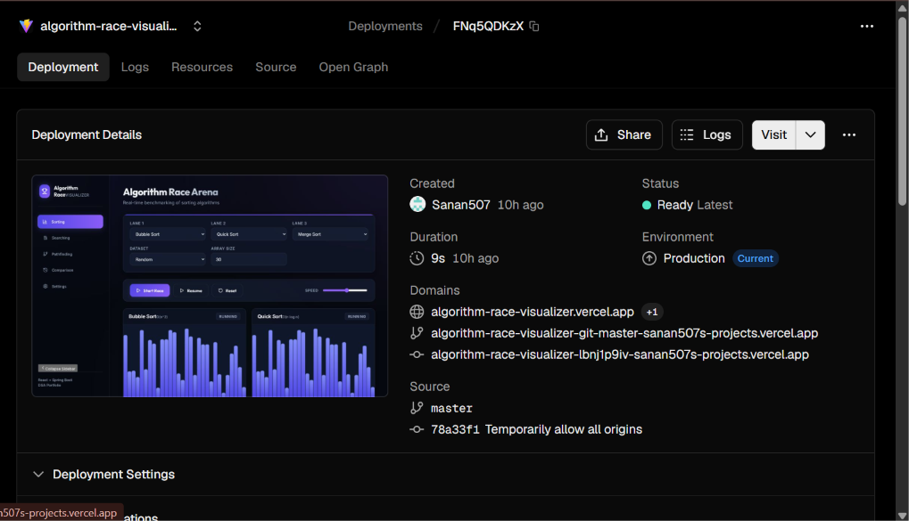

# AlgoRace — Algorithm Benchmark & Visualization Engine

<div align="center">


### **Visualize • Compare • Benchmark**

*A high-performance, full-stack interactive engineering platform designed to benchmark, debug, and race computer science algorithms in real-time.*

[**🌐 Live Application**](https://algorithm-race-visualizer.vercel.app) • [**📖 API Documentation**](https://algorithm-race-visualizer.vercel.app/swagger-ui.html) • [**⚡ Quickstart Guide**](#-local-development--setup)

</div>

## 📸 Visual Overview & Showcase

| **Multi-Lane Sorting Arena** | **2D Grid Pathfinding Arena** |
|:---:|:---:|
|  |  |

<div align="center">

### **Live Race Animation Demo**


</div>

---

## ⚡ What Makes AlgoRace Different?

Unlike static single-algorithm visualizers, **AlgoRace** is built around a concurrent **Head-to-Head Race Engine**. Multiple algorithms (e.g., *Quick Sort vs. Merge Sort vs. Heap Sort*, or *Dijkstra vs. A* Search*) run simultaneously on **identical, deterministic dataset seeds**.

### 🌟 Key Enterprise Features:
- **🎨 HTML5 Canvas 60 FPS Renderer**: High-density datasets ($N \ge 10,000$) animate at 60 FPS using hardware-accelerated 2D canvas contexts without DOM frame drops.
- **🧵 Web Worker Simulation Engine**: Complex algorithm simulations offloaded to background Web Worker threads (`simulationWorker.ts`), keeping the main UI thread 100% responsive.
- **🌐 Embeddable Iframe Widget & Zero-Chrome Mode**: Embed interactive algorithm visualizer races into external blogs (Dev.to, Medium, Hashnode), docs, and portfolios via `?embed=true` and the 1-click `<iframe src="...">` code generator.
- **🧠 LeetCode Prep Diagnostic Quiz Arena**: Interactive CS interview diagnostic assessment with real-time scoring, multiplier streaks, sound feedback, and in-depth technical explanations.
- **🔗 Deep-Link URL State & Permalinks**: Exact custom arrays, algorithm selections, speed, and size are encoded into URL query parameters for 1-click collaborative sharing.
- **📱 Mobile Responsive Tabbed Layout**: Automatic layout adaptation for mobile viewports (`< 768px`) with tabbed lane navigation and touch-optimized controls.
- **👁️ Colorblind & Accessibility Modes**: Built-in support for **Deuteranopia**, **Protanopia**, **High-Contrast Dark**, and **Light** presentation themes mapped via CSS Design Tokens (`:root`).
- **💻 Synchronized Multi-Language Code Tracing**: Real-time line-by-line code execution highlighter supporting **TypeScript, Java, Python, and C++** with step operation tags (`COMPARING`, `SWAPPING`, `VISITING`).
- **⏱️ Step-by-Step Debugger & Timeline Scrubber**: Drag-to-seek playback scrubber with instant frame seeking, step-forward/backward, and rate controls.
- **📊 Telemetry & Benchmark Data Exporter**: Export high-resolution 2x Retina PNG snapshots and sanitized CSV/JSON performance reports.
- **🔊 Web Audio API Synthesizer**: Polyphonic pitch-mapped acoustic feedback providing real-time audio chimes for swaps and comparisons.

---

## 💡 Why I Built AlgoRace

> *"I built AlgoRace because Big-O notation and static pseudocode never fully captured how algorithms actually behave for me. $O(n \log n)$ tells you the growth rate, but it doesn't show you why Quick Sort pulls ahead of Bubble Sort on the same dataset, or how Dijkstra's algorithm actually explores a graph step by step.*
>
> *AlgoRace turns that into something you can watch and interact with. Sorting algorithms race side by side on identical dataset seeds, search algorithms visualize their space elimination as it happens, and pathfinding runs on 2D grids you can edit and re-run in real time.*
>
> *It's a full-stack project: a Spring Boot Java backend generates deterministic simulation steps, a React 18 + TypeScript frontend renders them on HTML5 Canvas, and a Web Audio synthesizer adds sound feedback for comparisons and swaps."*
>
> — **Muhammad Sanan Sarwar** (Creator & Lead Engineer)

---

## 🎯 Supported Algorithms & Arenas

### 1. 📊 Sorting Arena (11 Algorithms)
Compare comparison and non-comparison sorting algorithms on identical array seeds:
- **Quick Sort** — $O(n \log n)$ avg, $O(n^2)$ worst, $O(\log n)$ space.
- **Merge Sort** — $O(n \log n)$ best/avg/worst, $O(n)$ space.
- **Heap Sort** — $O(n \log n)$ best/avg/worst, $O(1)$ space.
- **Tim Sort** — $O(n \log n)$ avg/worst, $O(n)$ best (Production hybrid sort).
- **Insertion Sort** — $O(n)$ best, $O(n^2)$ avg/worst, $O(1)$ space.
- **Selection Sort** — $O(n^2)$ best/avg/worst, $O(1)$ space.
- **Bubble Sort** — $O(n)$ best, $O(n^2)$ avg/worst, $O(1)$ space.
- **Comb Sort** — $O(n \log n)$ best, $O(n^2 / 2^p)$ avg, $O(1)$ space.
- **Shell Sort** — $O(n \log n)$ best, $O(n^{1.3})$ avg, $O(1)$ space.
- **Cocktail Shaker Sort** — $O(n)$ best, $O(n^2)$ avg/worst, $O(1)$ space.
- **Radix Sort & Counting Sort** — Linear non-comparison integer distribution sorting.

---

### 2. 🔍 Search Arena (5 Algorithms)
Benchmark searching algorithms on ordered array spaces:
- **Linear Search** — $O(1)$ best, $O(n)$ avg/worst.
- **Binary Search** — $O(1)$ best, $O(\log n)$ avg/worst.
- **Jump Search** — $O(1)$ best, $O(\sqrt{n})$ avg/worst.
- **Exponential Search** — $O(1)$ best, $O(\log n)$ avg/worst.
- **Interpolation Search** — $O(1)$ best, $O(\log \log n)$ avg, $O(n)$ worst.

---

### 3. 🗺️ Pathfinding Arena (5 Algorithms)
Visualize graph traversal and shortest-path calculation on custom 2D grid maps:
- **A\* Search** — Heuristic-guided optimal pathfinding.
- **Dijkstra's Algorithm** — Guaranteed shortest-path weighted exploration.
- **Breadth-First Search (BFS)** — Unweighted graph shortest-path queue traversal.
- **Bidirectional BFS** — Dual-frontier simultaneous search meeting in the middle.
- **Depth-First Search (DFS)** — Stack-based maze exploration.

---

### 4. 🧠 LeetCode Prep Diagnostic Quiz Arena
Test algorithmic trade-offs and complexity intuition with interactive technical interview questions:
- **Categorized Question Tracks**: Sorting, Searching, Pathfinding, Dynamic Programming, and Trees.
- **Multiplier Streaks & Live HUD**: Consecutive correct answers trigger score bonuses (`🔥 3 Streak`).
- **Comprehensive Explanations**: Deep technical breakdowns on runtime degradation, space complexity, and implementation edge cases.
- **Rank Tier Scorecards**: End-of-round performance rankings (**S-Tier Grandmaster**, **A-Tier Architect**, **B-Tier Practitioner**).

---

### 5. 🌐 Embedding AlgoRace in Your Website / Blog
Embed interactive visualizers inside any Markdown file, Medium post, Notion page, or portfolio writeup:

1. Click **Share Benchmark** on any race screen.
2. Select the **Embed Widget** tab and choose your preferred height (`420px`, `520px`, `640px`).
3. Click **Copy Code** and paste the snippet:

```html
<iframe 
  src="https://algorace.app/?page=sorting&embed=true#sorting" 
  width="100%" 
  height="520" 
  frameborder="0" 
  loading="lazy" 
  style="border-radius: 12px; border: 1px solid rgba(255,255,255,0.1); box-shadow: 0 12px 32px rgba(0,0,0,0.5);">
</iframe>
```

---

## 🛠️ Technology Stack

```
   ┌─────────────────────────────────────────────────────────────┐
   │                        FRONTEND                             │
   │  React 18  •  TypeScript  •  Vite  •  HTML5 Canvas 2D       │
   │  Web Audio API  •  Web Workers  •  CSS Design Tokens        │
   └──────────────────────────────┬──────────────────────────────┘
                                  │ HTTP / REST & WebSockets
   ┌──────────────────────────────┴──────────────────────────────┐
   │                        BACKEND                              │
   │  Java 21  •  Spring Boot 3.4  •  Maven  •  Spotless        │
   └─────────────────────────────────────────────────────────────┘
```

---

## 🔧 Local Development & Setup

### 1. Clone Repository
```bash
git clone https://github.com/Sanan507/AlgorithmRaceVisualizer.git
cd AlgorithmRaceVisualizer
```

### 2. Run Backend (Spring Boot 3.4)
```bash
cd backend
mvn spring-boot:run
```
*Backend server runs on `http://localhost:8080`.*  
*Swagger API Documentation is served at `http://localhost:8080/swagger-ui.html`.*

### 3. Run Frontend (React 18 + Vite)
```bash
cd frontend
npm install
npm run dev
```
*Frontend application runs on `http://localhost:5173`.*

---

## 🧪 Testing & Code Quality

```bash
# Frontend Typecheck & Build
cd frontend
npm run build
npx vitest run

# Backend Spotless & Checkstyle Format
cd backend
mvn spotless:apply
mvn test
```

---

## 👤 Author & Contact

- **Author**: **Muhammad Sanan Sarwar**
- **Email**: [sanansarwar507@gmail.com](mailto:sanansarwar507@gmail.com)
- **LinkedIn**: [sanan-sarwar](https://www.linkedin.com/in/sanan-sarwar)
- **GitHub**: [Sanan507](https://github.com/Sanan507)
- **License**: MIT License (Permissive Open Source)
