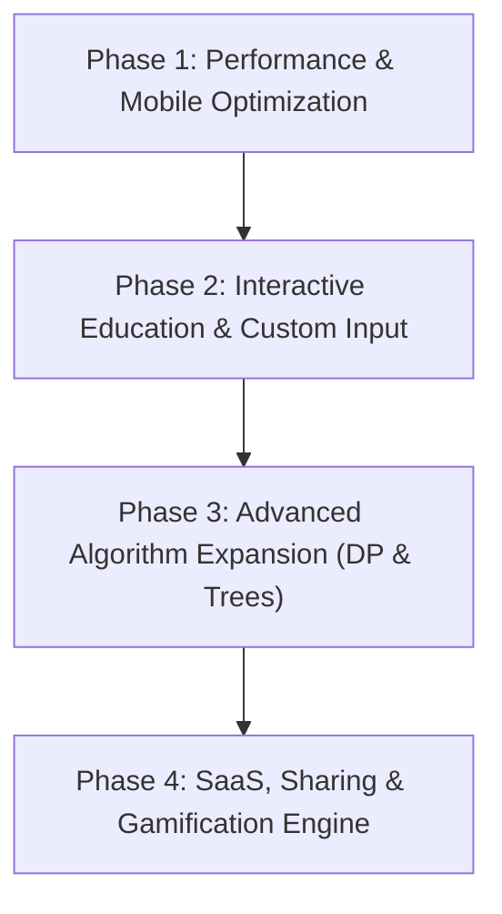

# Algorithm Race Visualizer (AlgoRace)
## Strategic Product Analysis & Market-Ready Implementation Roadmap

> **Audit Date**: August 2026  
> **Status**: Workspace Audit & Production Gap Analysis Complete

---

## 1. Executive Summary & Codebase Audit

We audited the **Google AI Studio Product Feedback** against the current codebase (`AlgorithmRaceVisualizerCopy1`). The project has a strong foundation with several advanced features already implemented (including multi-lane racing, telemetry cards, and multi-language code line tracing). 

Below is the definitive breakdown of **Existing Capabilities**, **Upgrades Needed**, and **Missing Features**.

---

### Matrix of Feature Status

| Feature Area | Feedback Item | Current Codebase Status | Status | Action Required |
|---|---|---|---|---|
| **Core Racing Engine** | Side-by-Side Head-to-Head Racing | Implemented for Sorting, Searching, & Pathfinding. | ✅ Done | Maintain & expand algorithm set. |
| **Code Line Debugger** | Multi-Language Code Tracing & Line Highlighting | Implemented in `CodeViewer.tsx` (TS, Java, Py, C++) with active line tracking. | ✅ Done | Add "Why Did This Happen?" step explanation popovers. |
| **Playback & Telemetry** | Timeline Scrubber & Stat Panels | Implemented in `Controls.tsx` (frame slider) and `LaneCard.tsx` / `AlgorithmComparisonCenter.tsx`. | ✅ Done | Add CSV/JSON telemetry exporter. |
| **Custom Inputs** | Custom Array & Grid Canvas Drawing | `arrayParser.ts` exists, but UI modal & drag-drawing on canvas grid are missing. | 🟡 Partial | Add Custom Input Modal & Interactive Canvas Painter. |
| **Audio Feedback** | Value-to-Pitch Synthesizer | Basic sound triggers exist in `AudioContext.tsx`. | 🟡 Partial | Upgrade to Web Audio API polyphonic value-to-frequency pitch mapping. |
| **Styling & Tokens** | Design Token Architecture & Accessibility | Hardcoded CSS colors in `styles.css`. | 🟡 Partial | Refactor to `:root` design tokens & add Colorblind (Deuteranopia) mode. |
| **Mobile Experience** | Mobile Responsive Stacked / Tabbed View | Multi-lane grid breaks on viewports <768px. | ❌ Missing | Build Mobile Tabbed / Stacked View with touch controls. |
| **Performance Engine** | Web Worker & Canvas/WebGL Renderer | React DOM `<div>` bars cause frame drops for $N > 500$. | ❌ Missing | Implement HTML5 Canvas / Web Worker streaming engine. |
| **Pathfinding Extras** | Maze Generators & Weighted Terrain | Only manual walls exist on grid. | ❌ Missing | Add Maze Generators (Recursive Division, Prim's) & Terrain Weights (Mud/Water). |
| **New Categories** | Dynamic Programming & Data Structure Trees | Only Array Sorting, Searching, and 2D Pathfinding exist. | ❌ Missing | Add Dynamic Programming Matrix (Knapsack, LCS) & BST/AVL Tree Visualizers. |
| **Share & Export** | URL Permalinks & GIF/MP4 Export | No URL encoding or video recording exists. | ❌ Missing | Implement URL Hash State & CanvasRecorder GIF/MP4 Exporter. |
| **Gamification** | LeetCode Prep & Quiz Mode | No quiz or diagnostic assessment mode. | ❌ Missing | Build Interactive Diagnostic Quiz & LeetCode Prep Arena. |

---

## 2. Multi-Phase Future Implementation Plan



---

### Phase 1: High-Performance Engine & Mobile Optimization (Immediate Impact)
*Goal: Ensure 60 FPS performance for large datasets ($N \ge 10,000$) and flawless mobile responsive experience.*

#### 1.1 Web Worker & HTML5 Canvas Rendering Engine
- **Web Worker Offloading**: Move algorithm simulation frame generation out of the main thread into a dedicated Web Worker (`frontend/src/workers/simulationWorker.ts`).
- **Canvas / WebGL Renderer**: Replace React DOM `<div>` bar elements with HTML5 Canvas (`<canvas>`) rendering for dataset sizes $N > 300$. Capable of animating 10,000+ elements at 60 FPS smoothly.

#### 1.2 Mobile Responsive & Touch-Optimized Layout
- **Tabbed / Stacked Mobile Layout**: On viewports `< 768px`, replace side-by-side split cards with an intuitive **Tabbed Race View** or **Vertical Stacked Cards** with sticky bottom playback controls.
- **Touch-Friendly Painting**: Optimize Pathfinding canvas wall painting for touch events (`onTouchStart`, `onTouchMove`).

#### 1.3 Design System & Accessibility (Colorblind Modes)
- **CSS Custom Property Tokens**: Systematically refactor `styles.css` into semantic `:root` design tokens (`--bg-primary`, `--accent-color`, `--state-comparing`).
- **Accessibility Themes**: Add Deuteranopia/Protanopia colorblind palette toggle and High-Contrast Mode.

---

### Phase 2: Interactive Education, Explanations & Custom Datasets
*Goal: Turn visual racing into an interactive learning and debugging environment.*

#### 2.1 "Why Did This Happen?" Step Explanations
- **Real-time Step Explanations**: Extend `CodeViewer.tsx` with a live explanatory log popover per frame:
  - *Example (Quick Sort)*: `"Pivot element 42 selected at index 8. Comparing element 15 (index 2) with pivot..."*
  - *Example (A* Search)*: `"Evaluating neighbor (12, 14) with g=14, h=8, f=22. Adding to open set priority queue."*

#### 2.2 Custom Datasets & Canvas Painting Suite
- **Custom Array Modal**: Modal allowing users to paste custom CSV/JSON array inputs or generate mathematical presets (Sine wave, Gaussian, Nearly Sorted).
- **Maze Generator Suite**: Implement automated maze algorithms for Pathfinding:
  - Recursive Division Maze
  - Prim's Randomized MST Maze
  - Binary Tree Maze Generator
- **Weighted Terrain Painting**: Allow painting weighted cells (Grass = cost 1, Mud = cost 5, Water = wall).

#### 2.3 Web Audio Value-to-Pitch Synthesizer
- **Polyphonic Web Audio API**: Map element array values to musical pitches (pentatonic scale 220Hz - 880Hz) to generate classic auditory algorithm soundscapes during races.

---

### Phase 3: Algorithm Category Expansion (Dynamic Programming & Trees)
*Goal: Expand beyond sorting and pathfinding into core Computer Science topics.*

#### 3.1 Dynamic Programming (DP) Grid Visualizer
- **Interactive DP Matrix Table**:
  - 0/1 Knapsack Problem
  - Longest Common Subsequence (LCS)
  - Edit Distance (Levenshtein Distance)
- **Cell Fill Animation**: Visually trace sub-problem lookup arrows (`dp[i-1][j]` vs `dp[i-1][j-w] + v`).

#### 3.2 Tree & Graph Data Structure Visualizer
- **Binary Search Tree (BST) & AVL Tree**:
  - Interactive Node Insertion, Deletion, and Self-Balancing AVL Rotations (LL, RR, LR, RL).
  - Red-Black Tree recoloring and tree restructuring visualization.

---

### Phase 4: SaaS Features, Shareability & Gamification (Market Ready)
*Goal: Drive viral growth, portfolio visibility, ed-tech adoption, and monetization capabilities.*

#### 4.1 URL Permalinks & Shareable State
- **URL Hash Encoder**: Encode race setup, algorithms, seed, dataset size, and speed into URL hash:
  `https://algorace.app/race?category=sorting&algo1=quicksort&algo2=heapsort&size=100&seed=89234`
- **One-Click Share Button**: Instant copy-to-clipboard permalink generation.

#### 4.2 GIF & MP4 Video Export Engine
- **CanvasRecorder / WebM Converter**: Add an "Export Video" button allowing educators and tech influencers to download visualizer animations as `.mp4` or `.gif` files for LinkedIn/X/YouTube.

#### 4.3 Embeddable Iframe Widget
- **Iframe Embed Code**: Generate light `<iframe src="https://algorace.app/embed?algo=quicksort"></iframe>` snippets for technical blog posts (Medium, Dev.to, Hashnode).

#### 4.4 LeetCode Prep Diagnostic Quiz Mode
- **Interactive Quiz Arena**:
  - Present automated race simulations and ask diagnostic questions:
    - *"Which algorithm used less memory during this race and why?"*
    - *"What is the worst-case scenario for the losing algorithm on this dataset?"*
  - Instant scoring, explanations, and progress badges.

---

## 3. Recommended Execution Priorities

```
Priority 1: Mobile Responsiveness & Web Worker Canvas Engine (Phase 1)
Priority 2: Custom Input Modals, Maze Generators & Step Explanations (Phase 2)
Priority 3: Dynamic Programming & Tree Structure Expansion (Phase 3)
Priority 4: Permalinks, Video Exporter & Quiz Mode (Phase 4)
```

---
*Generated for Algorithm Race Visualizer Copy1*
